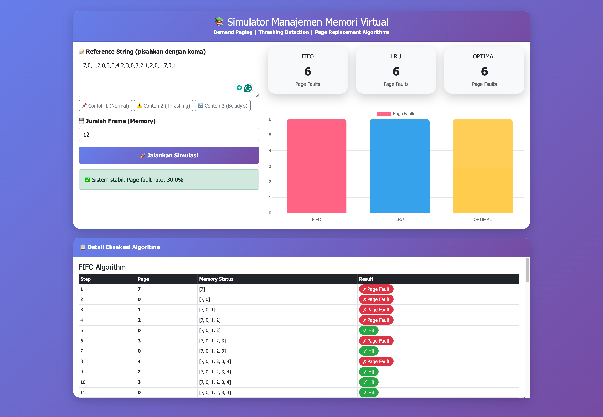

# Virtual Memory Simulator

Simulator manajemen memori virtual untuk pembelajaran Sistem Operasi.



Aplikasi ini menampilkan simulasi algoritma page replacement:
- FIFO
- LRU
- Optimal (MIN)

Frontend menggunakan HTML/CSS/JavaScript dengan `Chart.js`,
backend menggunakan `FastAPI` di Python.

## Fitur

- Masukkan `reference string` halaman
- Pilih jumlah frame memori
- Jalankan simulasi untuk:
  - FIFO
  - LRU
  - Optimal
- Tampilkan page fault count dan hit ratio
- Tampilkan detail langkah eksekusi untuk setiap algoritma
- Deteksi potensi thrashing berdasarkan page fault rate

## Struktur proyek

- `backend/`
  - `app.py` - API FastAPI untuk mengeksekusi simulasi
  - `algorithms.py` - implementasi algoritma FIFO, LRU, Optimal
  - `Dockerfile` - image backend
  - `requirements.txt` - dependensi Python
- `frontend/`
  - `index.html` - antarmuka pengguna simulator
  - `Dockerfile` - image frontend
- `docker-compose.yml` - menjalankan frontend dan backend bersama

## Persyaratan

- Docker
- Docker Compose

## Menjalankan aplikasi

Jalankan di direktori root proyek:

```bash
docker compose up -d --build
```

Buka browser ke:

- Frontend: `http://localhost:8080`
- Backend health check: `http://localhost:8000/health`

## API

Endpoint simulasi backend:

- `POST /simulate`

Contoh request body:

```json
{
  "reference_string": [7,0,1,2,0,3,0,4,2,3,0,3,2,1,2,0,1,7,0,1],
  "frames": 3
}
```

Response berisi hasil untuk ketiga algoritma beserta detail step dan analisis thrashing.

## Catatan

- Jika `frames` bernilai kurang dari 1 atau `reference string` kosong, backend akan mengembalikan error.
- Jumlah akses halaman maksimal dibatasi pada `200` item.

## Pengembangan

Jika ingin mengubah logika algoritma, edit `backend/algorithms.py`.
Jika ingin mengubah tampilan, edit `frontend/index.html`.

---

Selamat mencoba simulator manajemen memori virtual!